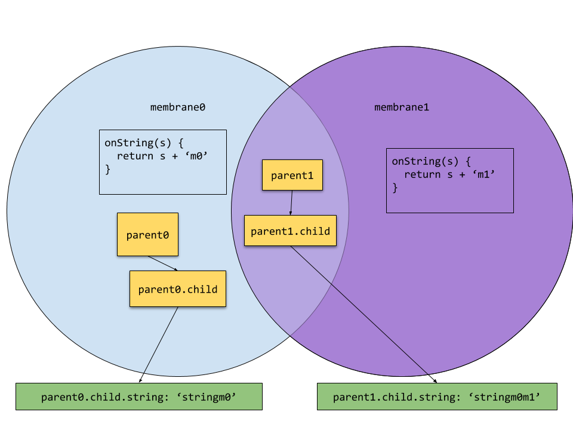

autoscale: true
theme: Plain Jane, 3
code: Hack
slidenumbers: true
footer: Ehden Sinai @ charmCityJs - 4/3/2019

[.header: alignment(center)]

# [fit] Playing with Proxy

## (And Reflect)

### (But Reflect Does Not Alliterate)

#### (So It Kinda Ruins the Title)

^ *useful talk notes*

---

[.autoscale: true]

[.header: alignment(center)]
# Hello, I'm Ehden

node.js agent engineer @ Contrast Security

@ehden (CCJS slack)
[github.com/cixel](https://github.com/cixel)
[ehdens@gmail.com](mailto:ehdens@gmail.com)
[ehden@contrastsecurity.com](mailto:ehden@contrastsecurity.com)


^ I'm an agent engineer at Contrast Security

^ Contrast makes web applications automatically detect vulnerabilities, identify attacks, and protect themselves

^ And it does this through runtime instrumentation

^ basically run inside customer's applications, watch what's going on

^ by adding behavior to existing code, as it's running

^ And the goal is to be as invisible as possible

^ We do this in 5 different languages right now, and I'm on the team that does this for Node.js

^ Now you might imagine that the implementation details differ a bit from language to language and it's up to each language team to fill up our own toolboxes with different ways to see what we need to see and do what we need to do

^ I'm going to talk about one of my favorite tools, Proxy

^ WHEN WE HEAR PROXY, WE TEND TO THINK LIKE A WEB SERVER PROXY

---

# Proxy

*Used to define custom behavior for fundamental operations (e.g. property lookup, assignment, enumeration, function invocation, etc).*[^1]

[^1]: [MDN](https://developer.mozilla.org/en-US/docs/Web/JavaScript/Reference/Global_Objects/Proxy)

^ It's not that.

^ here's the quick MDN definition

^ basically proxy lets you wrap objects and define custom behavior for a bunch of the basic operations that might be performed on that object

^ first appeared in ES6, so it's pretty new as far as the spec is concerned

^ and that means that people are still figuring out what the hell to do with it

^ part of finding out what you can and should do with something is to explore and just play around with it

^ so this is just going to be a bit of an intro and then some exploration of applications


---
[.text: alignment(right)]
[.header: alignment(right)]
[.footer-style: alignment(right)]
[.slidenumber-style: alignment(left)]

# Reflect

*Reflect is a built-in object that provides methods for interceptable JavaScript operations. The methods are the same as those of proxy handlers. Reflect is not a function object, so it's not constructible.*[^2]


[^2]: [MDN](https://developer.mozilla.org/en-US/docs/Web/JavaScript/Reference/Global_Objects/Reflect)

^ Reflect is Proxy's sister object.

^ It's a collection of static methods which let you do all the stuff you need to do inside of a proxy

^ you can use it anywhere, not just with Proxy, but its methods are meant to mirror Proxy traps behavior

^ if that doesn't immediately make sense, it will when you see it in action

---

## Terminology 📖

### **target**: the object being wrapped (_must_ be an object)

### **handler**: object which holds traps

[.code-highlight: all]
[.code-highlight: 2-4]
[.code-highlight: 5-9]

```javascript
const proxy = new Proxy(
	{
		foo: 'bar'
	},
	{
		get(tar, prop, recv) { /* ... */ },
		set(tar, prop, val) { /* ... */ },
		// ...
	}
);
```

^ a few definitions to be aware of

^ BUILD

^ [MAYBE DRINK HERE]

^ target is kinda self-explanatory

^ BUILD

^ all the traps for the proxy collectively are the handler

---

## Terminology 📖

### **trap**: method providing intercept behavior for an operation

* `apply()`
* `construct()`
* `defineProperty()`
* `deleteProperty()`
* `get()`
* `getOwnPropertyDescriptor()`
* `getPrototypeOf()`
* `has()`
* `isExtensible()`
* `ownKeys()`
* `preventExtensions()`
* `set()`
* `setPrototypeOf()`

^ traps are the methods that define your custom behavior, name comes from OS traps

---

## Terminology 📖

### **invariant**: condition which must be satisfied by a trap

```javascript
const s = new String('hello');

const p = new Proxy(s, {
	get(target, property, receiver) {
		return 'fish';
	}
});


console.log(p[0]);
// TypeError: 'get' on proxy: property '0' is read-only and you tried to do something PRETTY silly there, friend
```

^ need to mention these

^ invariants are checks which prevent you from doing something really stupid

^ for each trap, there are different sets of invariants

^ MDN does a good job of telling you what these are

^ but they exist to keep you from doing something which makes no sense

^ you can't say, for instance, that the 0th character of a string object is 'fish'

^ this would probably crash v8

^ so instead you get a TypeError

^ so let's see an example of how you can use Proxy

---

[.code-highlight: all]
[.code-highlight: 1]
[.code-highlight: 3-20]
[.code-highlight: 4-19]
[.code-highlight: 22]
[.code-highlight: all]

^ first time I used this slide was for a group of college students, and there reaction was like. there wasn't one. I think the reference was completely lost on them because they weren't old
[BUILD]

^ person is the target
[BUILD]

^ handler is... the handler
[BUILD]

^ and you can see that it holds a couple of methods, get and set. these are *traps* for getting and setting properties
[BUILD]

^ then we call new proxy, passing the target and handler
anything get or set to borg will invoke those traps we defined in the handler

```javascript
const person = new Person('Jean-Luc Picard');

const handler = {
	get(target, property, receiver) {
		if (property === 'name') {
			return 'Locutus of Borg';
		}

		return Reflect.get(...arguments);
	},

	set(target, property, value) {
		if (property === 'name') {
			// don't actually set
			console.log('Resistance is futile.');
			return true
		}
		return Reflect.set(...arguments);
	}
};

const borg = new Proxy(person, handler);
```


---

#*"Star Trek TNG is cool so Proxy should be added to the spec"*

### --W3C, Ecma, Brendan Eich, and Patrick Stewart

#### (all at the same time and in weird, hive-mind-like unison)

^ toy examples are fun but don't answer: what the hell do you do with Proxy

^ so besides making contrived sci-fi references, there's a bunch of cool stuff you can do with Proxy/Reflect

^ and again, they're pretty new and haven't seen a ton of use yet, so much of what those cool things are is still being actively figured out

^ but IMO the best way to see what something can really do is just mess around with it

^ so I'm gonna show a bunch of stuff you can do with Proxy/reflect, ranging from super useful to probably useless

---

# [fit] 1. Logging, Spying, Validating

---

```javascript
const p = new Proxy({}, {
	get(tar, prop, recv) {
		console.log(`getting ${prop}`);
		return Reflect.get(...arguments);
	}

	set(tar, prop, value) {
		console.log(`setting ${prop}`);
		return Reflect.set(...arguments);
	}
});

p.a = '!'; // setting a
```

^ one of the most basic uses is to add logging or validation

^ rather than redefining all the properties in an object as a setter or getter, you can do this

^ and it lets you spy on gets/sets of things which don't exist on the object yet

^ can also do validation!

---

# [fit] 2. Monkey Patching

  

^ many of you probably know this, but monkey patching is changing or extending the functionality of a function at runtime

^ monkey patching lets you spy on code, change its behavior, add behavior, etc

^ in most connotations it's considered an anti-pattern but it's pretty amazing for doing some things

---

# the "old" way

```javascript
class MyClass {
	constructor() {}

	someFunction() {
		// do something
	}
}

const someFn = MyClass.prototype.someFunction;
MyClass.prototype.someFunction = function() {
	doSomething(this, arguments);
	const result = someFn.apply(this, arguments);
	doSomethingElse(this, arguments, result);
};
```

^ this is kind of the canonical way to patch

^ save the original function, re-define it, then clobber the reference and throw your own function in

^ this lets you do whatever you want to the this, args, result, etc

---

# using Proxy/Reflect

```javascript
class MyClass {
	constructor() {}

	someFunction() {
		// do something
	}
}

MyClass.prototype.someFunction = new Proxy(MyClass.prototype.someFunction, {
	apply(target, thisArg, args) {
		doSomething(thisArg, args);
		const result = Reflect.apply(...arguments);
		doSomethingElse(thisArg, args, result);
	}
})
```

^ so here is the implementation using a proxy

^ all we're trapping is apply

^ though to be completely correct we'd probably want to trap construct as well

^ nothing super crazy here. so why this vs the old way?

^ well for starters the original function still exists outside of the closure we created

^ but you also get a lot of other things: properties like function length, name, and toString are all perfectly preserved

^ calling .apply directly also makes assumptions about the function never having been clobbered,

^ or having its own apply function which shadows the apply we all know and love

---

# [fit] 3. Dynamic APIs

^ this one could be useful for like making SDKs or something,

^ i dunno, I just think it's cool

---

```javascript

const obj = {};

function APIify(obj) {
	const handler = {
		get(tar, prop, recv) {
			if (prop.startsWith('get')) {
				const name = prop.substring(3);
				name[0] = name[0].toLowerCase();
				return function() {
					// make some REST request?
				}
			}
		}
	};
	return new Proxy(obj, handler);
}

const A = APIify(obj);
A.getSomeStuff();

```

^ so you can write a get trap which uses the name of the property to generate a function

^ and return a function that'll make some http request or something for you

^ the bigger point here is-

^ you don't have to use traps to deal with things that already exist on the object

---

# [fit] 4. Revoking Access to an Object

^ there's two ways to do this

^ the first is:

---

# `Proxy.revocable()`

```javascript
const obj = { a: 'test' };

const revocable = Proxy.revocable(obj, {
	// ...
});

revocable.revoke();

console.log(obj.a); // TypeError
```

^ Proxy has this static method revocable that gives you a proxy which has a revoke() method on it

^ when that's called, triggering any trap at all in the proxy results in a type error

^ this lets you create like temporary proxies

^ you can use this for a bunch of stuff. it's good if you may not completely trust a component you're giving object references to

^ but maybe you don't want to fully revoke the proxy

---

## Partially Revocable Proxies

```javascript
class Fickle {
	constructor() { this.revoked = false; }

	proxy(obj) {
		const handler = {
			get: (tar, prop, recv) => {
				console.log(this);
				if (this.revoked) throw new TypeError('nah');

				return Reflect.get(tar, prop, recv);
			}
		};
		return new Proxy(obj, handler);
	}

	revoke() { this.revoked = true; }
	restore() { this.revoked = false; }
}

const fickle = new Fickle();
const revokable = fickle.proxy({ a: 'test' });
fickle.revoke();
console.log(revokable.a); // TypeError: nah
```

^ so this is the first time you'll see us creating an abstraction on Proxy

^ here it's because we need some way to manage this revoked state

^ you can add as many things as you want to Fickle, and revoke them all at once

^ and not all traps need to be revoked anymore, or revoked all the time, you can add whatever logic you want

^ like if the property starts with Q you're fine

^ so... why didn't I just extend Proxy??

^ can't. it's an 'exotic' object, there's no actual prototype. they're weird.

^ you can't extend them, but it's fine. you'll be ok.

---

# [fit] 5. Bodyless Functions

^ this one is gonna seem useless at first

^ it probably is.

^ but it's fun?

---

```javascript
const f = new Proxy(function() {}, {
	apply(t, thisArg, args) {
		function actualFunction() {
			console.log('hi');
		}

		return Reflect.apply(actualFunction, thisArg, args);
	}
});

f(); // hi
console.log(f.toString()); // 'function () {}'
```

^ so this one's just weird, but I like it

^ you can pass around a function that looks like nothing

^ but when it runs, it does whatever you want

^ so I don't know why you'd ever do ths

^ but that doesn't mean we should't

^ after all this is about exploring

---

# [fit] 6. Recursive Proxies

---

[.code-highlight: all]
[.code-highlight: 3]
[.code-highlight: 5,7]
[.code-highlight: 6]

```javascript
const handler = {
	get(tar, prop, recv) {
		const result = Reflect.get(...arguments);

		if (result && typeof result === 'object') {
			return new Proxy(result, handler);
		}

		return result;
	}
}
```

^ what're we doing here

^ BUILD

^ get the result

^ BUILD

^ check if the result exists and is an object

^ BUILD

^ wrap the result in a proxy, using this handler

^ so when you do a get on that proxy, it'll also be wrapped, and so on

^ you are encapsulating the entire object graph

---

# [fit] 7. Proxy Membranes

^ so this one is an extension of the last

---

```javascript
class Membrane {
	constructor() {
		// map wrapped --> Mapping
		this.mappings = new WeakSet();
	}

	wrap(obj) {
		const handler = makeHandler(this);

		return new Proxy(obj, handler);
	}

	includes(val) { return this.mappings.has(val); }

	getMapping(t) { return this.mappings.get(t); }

	// "base case"; do whatever you want in here!
	onPrimitive(p) { return p; }
}
```

^ this is a way to formalize our recursive proxy a bit and build something 

---

```javascript
/**
 * Mapping formalizes the association between wrapped and unwrapped versions of objects in the Membrane.
 */
class Mapping {
  constructor(orig, wrapped) {
    /** original (fully unwrapped). equals target if this is the only membrane the orig belongs to. */
    this.orig = orig;
    /** proxy */
    this.wrapped = wrapped;
  }
}
```

---

```javascript
function makeHandler(membrane) {
	const handler = {
		get(tar, prop, recv) => {
			const result = Reflect.get(...arguments);

			if (membrane.includes(tar)) {
				return membrane.getMapping(tar).wrapped;
			}

			if (result && typeof result === 'object') {
				const wrapped = membrane.wrap(result);
				const mapping = new Mapping(target, wrapped);

				membrane.mappings.set(target, mapping);
				membrane.mappings.set(wrapped, mapping);

				return wrapped;
			}

			return membrane.onPrimitive(p);
		}
	};

	return handler;
}
```

^ talk about safe keys and how irl you also want

^ getOwnPropertyDescriptor, set, delete, defineProperty, and deleteProperty

---



[.hide-footer]

^ here's my attempt at an illustration of that

^ these are also recursive proxies, so we're still encapsulating entire object graphs

^ but this abstraction allows us to define custom behaviors at each point and even compose multiple membranes

^ explain what the symbols are

^ don't even have to be primitives---you get to decide what comes out of your membrane

^ but only objects and live in the membrane

^ that onString method can do whatever, I think I had it as onPrimitive in the code snippets

^ we use this in the agent for watching things which come off of reqeusts

---

# Others!

[.build-lists: true]

- specifying default values for fields on objects you don't control creation of
- cascading property changes - flip a switch to change several values
- [make arrays accessible as objects](https://developer.mozilla.org/en-US/docs/Web/JavaScript/Reference/Global_Objects/Proxy#Finding_an_array_item_object_by_its_property)

---

# [fit] This is all super dope, so why isn't Proxy used everywhere?

^ you can do a lot of cool stuff with Proxy

^ and it's built into the language

^ and has been for a couple of years now

^ so why aren't people swarming?

^ when I first saw them I thought I had found the holy grail

^ and don't get me wrong, this thing is incredibly useful

^ but the bulk of the issues I had came down to one thing

---

# Transparency

[.quote: alignment(left)]
>*“And these are your reasons, my lord?"*

[.quote: alignment(left)]
>*"Do you think I have others?" said Lord Vetinari. "My motives, as ever, are entirely transparent."*

[.quote: alignment(left)]
>*Hughnon reflected that 'entirely transparent' meant either that you could see right through them or that you couldn't see them at all.*
--Terry Pratchett, The Truth


^ "my motives, as ever..."

^ in software especially, the word transparent can mean two completely different things

^ each definition has its value

^ different uses of proxy can be different kinds of transparent, and even both kinds at once under different lenses

^ and I think it's important to think about the attribute of transparency whenever you're doing any kind of instrumentation

^ which is an exercise that takes a bit of getting used to

^ so as I go through these, try to think for yourself about where semantic changes may occur, and how each use of a proxy may result in unintended interactions with the outside world

^ the bottom line is none of this is free.

^ right now i think a lot of the cooler applications of Proxy are gated behind the need to predict and understand what you're paying to use it

^ but this is javascript, and people are going to find ways to build really cool, robust APIs from this stuff

^ so just keep your eyes open, because I think Proxy is just getting started

---

__The End!__

[.autoscale: true]
[.header: alignment(left)]

Contact:

[.list: bullet-character(>)]
- @ehden (CCJS slack)
- [github.com/cixel](https://github.com/cixel)
- [ehdens@gmail.com](mailto:ehdens@gmail.com)
- [ehden@contrastsecurity.com](mailto:ehden@contrastsecurity.com)

Presentation Materials:

- [github.com/cixel/charmcityjs-apr2019](https://github.com/cixel/charmcityjs-apr2019)

Image Credits:

- [Contrast Security](https://www.contrastsecurity.com)
- [H2g2bob \[CC0\]](https://upload.wikimedia.org/wikipedia/commons/b/bb/Proxy_concept_en.svg)
- [Borg](https://www.gettyimages.com/detail/news-photo/patrick-stewart-as-captain-jean-luc-picard-partially-news-photo/468146916)
- [Lord Vetinari by juliedillon](https://www.deviantart.com/juliedillon/art/Lord-Vetinari-92120272)
- [Join the Team](https://github.com/Contrast-Security-OSS/join-the-team)


